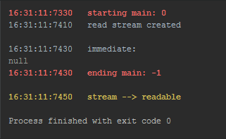
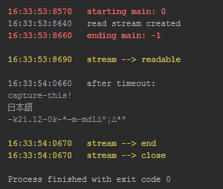
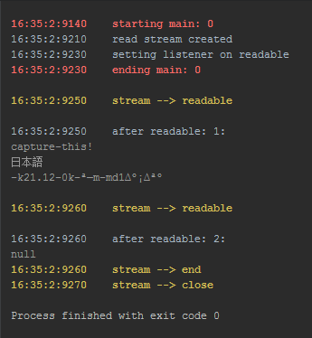

### stream.Readable emits `readable` twice
##### If I set a listener on `readable`, the `readable` event fires again after `stream.read()`
##### node version 5.12, windows 10
### If I read immediately after creating the stream, I get null

    stream = fs.createReadStream(inFile);
    result = stream.read();

### If I read after 200 msec, read succeeds and no further `readable` events are emitted

    function _main() {
        result = stream.read();
    }
    setTimeout(_main, delay);

### If I read in a call-back on the `readable` event, read succeeds but a second `readable` event is emitted

        stream.on('readable', () => {
            result = stream.read()
        });

### The unsimplified, main code is...: 

    function main(repeats) {
    
        console.log(`\n${ESC}${BOLD};${RED}m${stamp()}starting main: ${repeats}${ESC}m`);
    
        // connect a readstream to the same file
        stream = specs.Stream();
    
        // try to read it
        if(options.immediate)
            logit(`immediate`, 0);  // null
    
        if(options.timer)
            logit(`after timeout`, options.timer);  // success, no more readable events
    
        if(!options["not-on-readable"])
            stream.on('readable', (() => {
                console.log(`${stamp()}setting listener on readable`)
                var count = 0;
                return () => {
                    logit(`after readable:\t${++count}`, 0);
                    if(repeats)
                        stream.on('close', main.bind(this, --repeats))
                }
            })());  // success, but a second readable event is emitted
        else
            main.bind(this, --repeats);
    
        console.log(`${ESC}${BOLD};${RED}m${stamp()}ending main: ${repeats}${ESC}m\n`);
    }

    main(options.repeats);
    
### [GIT Repo with complete working example](https://github.com/cool-Blue/node-file-streams)